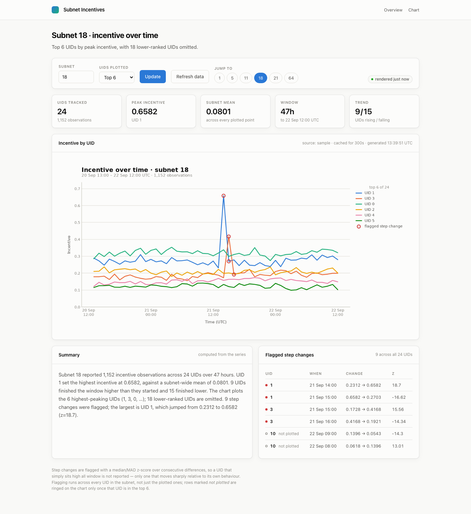
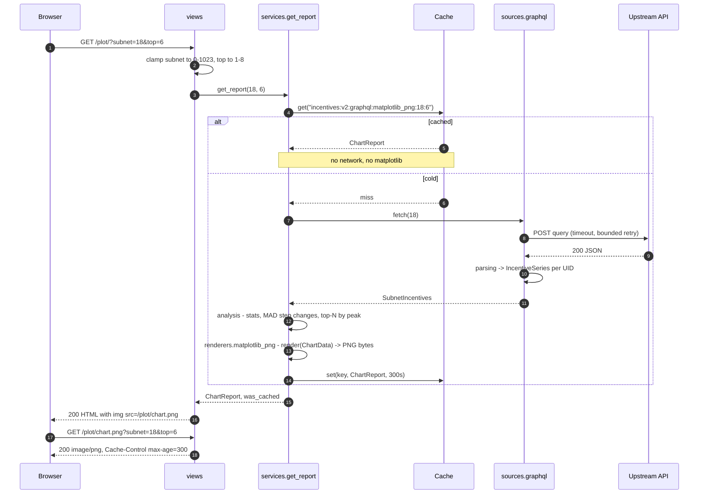

# graphql-incentives

A small Django app that asks a Bittensor-style GraphQL API for one subnet's
per-UID **incentive** time series, flags step changes in it, and draws the
highest-peaking UIDs as a chart.

It is a GraphQL **client**, not a server: no schema, no resolvers, no models, no
database, no accounts. (The project package is called `graphql` for historical
reasons — `graphene` and `graphql-core` are not installed.)



That is the whole product. Three more screens, captured with Playwright at
1440x900 against the deterministic `sample` source, hence reproducible:

| | |
| --- | --- |
| [Top four UIDs](docs/screenshots/top-four.png) | At four series or fewer the renderer swaps the legend for direct end-of-line labels (`DIRECT_LABEL_LIMIT`). |
| [Overview](docs/screenshots/overview.png) | The landing page and subnet picker. |
| [Upstream unavailable](docs/screenshots/upstream-down.png) | A dead upstream is a 503 page offering other subnets, not a traceback. Nothing is cached from a failed fetch, so "Try again" costs exactly one request. |

## Run it

```bash
python -m venv project_venv && source project_venv/bin/activate
pip install -r requirements.txt
INCENTIVES_SOURCE=sample python manage.py runserver 8240   # then :8240/
```

No `migrate` step — there is no database. `sample` is the in-box deterministic
generator (24 UIDs, 48 hours hourly, seeded from the subnet id), so the app is
populated with no credentials and no network. Drop it and the default source is
`graphql`, pointed at `GRAPHQL_API_URL`.

`Dockerfile` and `docker-compose.yml` are committed (multi-stage, non-root,
gunicorn, app plus Redis on host port 8240 with `INCENTIVES_SOURCE=sample`) — but
know how far that got checked: this repo's uplift report records `docker compose
config` as parsing OK, and both **Build verified** and **Boot verified** as
`NOT RUN — deferred, RAM constraint`.

## What happens on a request to `/plot/`



Four routes in total: `/`, `/plot/`, `/plot/chart.png`, `/healthz`.

## The cache key is the design

A fetch plus a matplotlib render inside the request cycle is a few hundred
milliseconds of CPU per hit, so the whole `ChartReport` — image bytes, stats,
anomalies, summary — is cached as one unit for `INCENTIVES_CACHE_TTL` (300s):

```
incentives:v{CACHE_VERSION}:{source}:{renderer}:{subnet}:{top_n}    # services.cache_key
```

- **cache version** — the cached value is a pickled `ChartReport` dataclass, so
  adding a field makes every existing entry the wrong shape. Bumping
  `CACHE_VERSION` retires the old namespace instead of unpickling a stale one.
- **source name** — the sharp one. Flipping `INCENTIVES_SOURCE` from `sample` to
  `graphql` must not serve a synthetic chart as if it were live, and without the
  source in the key that mistake is silent and looks correct.
- **renderer name** — a second renderer emits different bytes under a different
  content type for the same subnet and top-N.
- **subnet and top-N** — `test_a_different_top_n_is_a_different_cache_entry`.

Redis when `REDIS_URL` is set (shared across gunicorn workers and replicas),
locmem otherwise — correct either way, just per-process. The chart also lives at
`/plot/chart.png` under `Cache-Control: public, max-age=<TTL>` matching that TTL,
so browsers and proxies cache the expensive artefact independently and the page
can show a skeleton while it loads.

## Three ways the data bites

Each has a named regression test — the checkable part.

**String UIDs.** GraphQL `ID` scalars serialise as strings, so a uid arrives as
`"3"` as readily as `3`, while `IncentiveSeries.uid` is typed `int` and
`select_top_series` sorts on it — a mixed batch raises `TypeError` at request time.
`parsing.extract_incentive_points` coerces with `int()`, skipping non-numeric
entries (`test_coerces_string_uids_because_graphql_ids_are_strings`).

**Sample values above 1.0.** Incentive is a normalised share in [0, 1], so demo
data outside it is something the real network cannot produce. The generator
applies its spike multiplier to a scaled base and hard-clamps the result
(`test_values_stay_inside_the_normalised_range`).

**Anomalies the chart cannot ring.** Flagging runs subnet-wide, but only plotted
UIDs can be circled. Off-chart rows get a hollow marker and a "not plotted"
label, the card meta reads "9 across all 24 UIDs", and a footnote says so
(`test_flagged_uids_that_are_not_plotted_are_marked_as_such`).

## Modules, and two seams

Dependency arrows point inward at `domain`, which imports no Django,
`requests` or matplotlib.

```
incentives/
  domain.py      frozen dataclasses — the vocabulary every layer speaks
  parsing.py     GraphQL wire format -> domain. Pure.
  analysis.py    stats, median/MAD outliers, the computed narrative. Pure.
  sources.py     seam 1: IncentiveSource protocol + graphql / sample registry
  renderers.py   seam 2: ChartRenderer protocol + matplotlib PNG
  narrator.py    optional LLM rewrite of the computed narrative
  services.py    the pipeline and the cache — the only module that sees all of it
  views.py       parameter validation and template choice. Nothing else.
```

Both registries resolve by name and raise on an unknown one rather than falling
back silently, so a typo in the environment surfaces instead of quietly serving
fake data. Neither seam is speculative — `sample` makes a fresh boot populated
and the screenshots reproducible.

**Legend.** A subnet holds up to 256 UIDs, and 256 labels is not a legend. The
chart plots the top N by peak (default 6, ceiling 8 — the categorical palette
has eight fixed slots and is never cycled) and states the remainder as the
legend title: "top 6 of 24" above. A ninth series is never given a generated
colour, it is folded into the omitted count.

**Flagging** uses a median/MAD z-score (threshold 3.5) over *consecutive
differences*: a UID sitting high all day is not an anomaly, and a single spike
inflates a standard deviation enough to hide itself.

**The AI summary** can only rephrase. `narrator.py` hands the model statistics
the app already computed, so it cannot invent a number the chart does not
support. Every failure path — no key, `anthropic` absent, API error, empty
response — falls back to `analysis.describe`, and the page badges which you got.

## Settings

Every knob has a working default; the full list is in `graphql/settings.py`.

| Variable | Default | Effect |
| --- | --- | --- |
| `INCENTIVES_SOURCE` | `graphql` | `graphql` or `sample`. Unknown names raise. |
| `GRAPHQL_API_URL` | `https://api.taomarketcap.com/graphql` | Upstream endpoint. |
| `GRAPHQL_SUBNET_UID` | `18` | Subnet used when the request has no `?subnet=`. |
| `GRAPHQL_REQUEST_TIMEOUT` / `_MAX_RETRIES` / `_RETRY_BACKOFF` | `10.0` / `2` / `0.5` | Upstream call budget. Retries only on connect/read errors and 429/500/502/503/504. |
| `INCENTIVES_TOP_N` | `6` | Default UIDs plotted. `?top=` is clamped to 1–8. |
| `INCENTIVES_CACHE_TTL` | `300` | Report TTL, and the `max-age` sent with the PNG. |
| `REDIS_URL` | *(unset)* | Set it and the cache is shared across workers. |
| `ANTHROPIC_API_KEY` / `ANTHROPIC_MODEL` | *(unset)* / `claude-opus-5` | Enables the written summary. `AI_SUMMARY_ENABLED` is an independent kill switch. |
| `DJANGO_SECRET_KEY` / `DJANGO_DEBUG` | insecure dev key / `False` | Set a real key when deployed. `DEBUG` is off by default. |

## Tests

```bash
pip install -r requirements-dev.txt     # runtime requirements + ruff
python manage.py test                   # Ran 135 tests in 2.968s / OK
ruff check . && ruff format --check .
```

No test performs network I/O, touches a database or spends money:
`requests.Session.post` is patched and `test_narrator.py` injects a fake
`anthropic` module. Two thirds of the suite runs against `parsing`, `analysis`
and `domain` — functions of their arguments, needing no mocks.

## What it does not do

- **One upstream, one hard-coded query document.** Not a general GraphQL client.
- **The window is whatever upstream returns** — no date range, no pagination.
- **Rendering is synchronous on a miss**, and there is no stampede protection —
  N simultaneous requests on a cold key all render. A deliberate trade at this
  size: the TTL makes misses rare, and at real traffic the next step is
  pre-rendering popular subnets on a schedule, not a worker in the request path.
- **Flagging is statistical, not causal.** A UID moved sharply, not why.
- **`sample` data is synthetic** — real-shaped, but generated. Screenshots use it.
- **No authentication and no rate limiting.**
